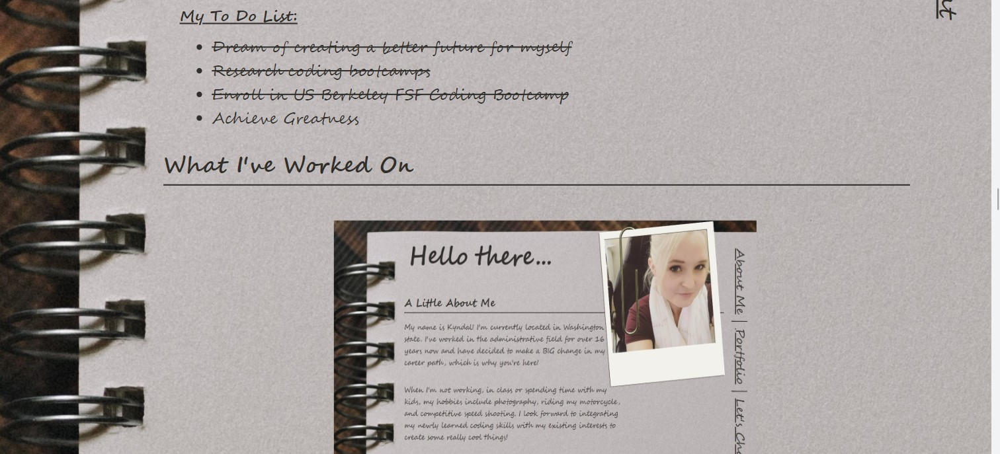
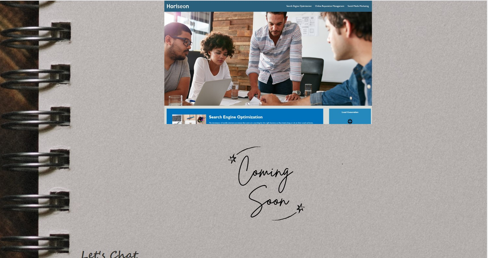
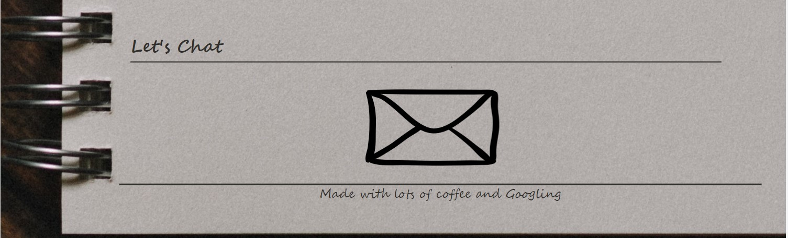

# my-portfolio

## Description

Created the beginnings of a professional portfolio webpage to display projects I work on throughout the bootcamp and on my own.  This is to create a space to allow potential future employers and collaborators to see my talents and what I have to offer.

## Usage

Utilizing the URL, access the webpage from any electronic device.  Responsive design elements and media queries will alter the display to fit the screensize.

## Images
    

## Credits

Image sources:
    
Background Notebook Image: https://unsplash.com/photos/dgVSuJu58C0

Email Envelope Icon: https://www.google.com/url?sa=i&url=https%3A%2F%2Fwww.onlinewebfonts.com%2Ficon%2F56680&psig=AOvVaw0PkR3juXJCHLAA3Kiq3hfc&ust=1684086026339000&source=images&cd=vfe&ved=0CBAQjRxqFwoTCMig7rzr8v4CFQAAAAAdAAAAABAJ

## License

N/A

## Link